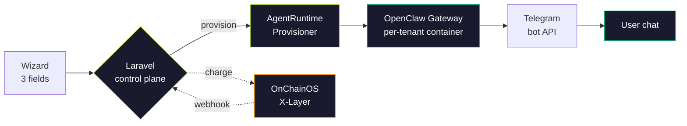

<p align="center">
  
</p>

<p align="center">
  <a href="https://platform.thespawn.io"></a>
  <a href="https://platform.thespawn.io"></a>
  <a href="https://github.com/SwiftAdviser/hosting-platform"></a>
  <a href="LICENSE"></a>
  <a href="https://laravel.com"></a>
  <a href="https://www.php.net"></a>
</p>

---

# platform.thespawn.io

**Ship faster. Host once.**

> *One-click hosting for laptop-bound agents. No tutorials, no chain prompts, no signature popups.*

See demo: https://x.com/thespawnio/status/2044513350948704480

A dev brings an agent that only runs on their laptop, signs in with Google, pays once through OnChainOS on X-Layer, and ends up with a live OpenClaw Gateway reachable on Telegram.

The wallet is provisioned server-side. The user never types a seed phrase, never sees a gas estimate, never approves a signature. Closer to Vercel for agents than to a crypto wallet.

Built for the X-Layer hackathon, April 2026.

## Why it matters

1. **Vercel for agents.** Local to cloud in 60 seconds, not a tutorial chain. Paste a Telegram token, hit a button, your agent is online.
2. **Crypto hidden.** Wallet is provisioned server-side through OnChainOS. The user never sees a chain name, a gas price, or a signature prompt. If they did, we failed the UX test.
3. **Three fields, not three forms.** Name, Telegram token, allowlist. That is the entire wizard. Every field not in those three shipped after the hackathon.
4. **Per-tenant isolation by default.** Each deploy lands in its own container on Coolify with its own wallet, its own bot, its own allowlist. No shared runtime, no noisy neighbors.
5. **Walkthrough-first.** The PRD locks a 7-step demo. If a feature does not serve one of those steps, it is not in v0.1. Scope discipline over feature count.

## The walkthrough

The entire v0.1, seven steps, end to end:

1. Open `platform.thespawn.io`.
2. Sign in with Google.
3. Click **Post agent** and fill three fields: name, Telegram bot token, allowlist.
4. Pay from the server-provisioned wallet via OnChainOS on X-Layer.
5. Agent uploads to OpenClaw under the hood.
6. Paste the returned token ID into the Telegram bot.
7. Bot replies: *"Hi, I'm your new agent. Here's your wallet address."*

Every other feature is out of scope. If it is not serving one of those seven steps, it ships after the hackathon.

## How it works



> The payment and the provision are decoupled. OnChainOS confirms the charge asynchronously by webhook. The runtime provisioner is an interface: v0.1 ships a Coolify backend and a demo stub, next up is Fly.io Machines.

## What's inside

| Layer | What it does |
|-------|-------------|
| **Control plane** | Laravel 12 orchestrates the 7-step walkthrough via `AgentDeployerService` |
| **Frontend** | Blade + hand-rolled CSS. Editorial-terminal aesthetic. No React in v0.1 |
| **Agent runtime** | `AgentRuntimeProvisioner` interface with a Coolify backend and a demo stub |
| **Chat surface** | Telegram bot, validated and registered per tenant before deploy |
| **Payments** | OnChainOS charge sessions, signed webhooks, idempotent receipts |
| **Chain** | X-Layer. The user never sees the chain name |
| **Identity** | Google OAuth via Laravel Socialite. One session, one wallet |
| **Deploy** | Coolify on `krutovoy-vps` via the `/coolify-ops` skill |
| **Hosting** | Per-tenant container from `docker/openclaw-agent/`. Immutable image |
| **CI** | PHPUnit, 89 tests, real DB, anonymous-class fakes, no mocks |

## Tech stack

| Component | Choice |
|-----------|--------|
| Framework | Laravel 12 |
| Language | PHP 8.4 |
| Database | PostgreSQL (SQLite in-memory for tests) |
| Frontend | Blade + Tailwind-free hand CSS |
| Auth | Laravel Socialite, Google OAuth |
| Agent runtime | OpenClaw per-tenant Node Gateway |
| Payment rail | OnChainOS |
| Chain | X-Layer |
| Hosting | Coolify |
| Tests | PHPUnit, in-file anonymous-class fakes |
| Lint | Laravel Pint |

## Architecture

```
app/
  Services/
    AgentDeployerService.php            orchestrates the 7-step walkthrough
    TelegramBotRegistrarService.php     validates bot token, sets webhook
    OnChainOSPaymentService.php         opens charge session, handles receipts
    Runtime/
      AgentRuntimeProvisioner.php       interface for per-tenant runtime
      TenantSpec.php                    inputs: name, token, allowlist, wallet
      TenantHandle.php                  outputs: container id, URL, status
      TenantStatus.php, TenantStatusSnapshot.php
      Coolify/
        CoolifyAgentRuntimeProvisioner  Coolify API backend for v0.1
        CoolifyApiException             typed error surface
      Demo/
        DemoAgentRuntimeProvisioner     in-memory stub for demo mode
    OnChainOS/
      OnChainOSClient.php               interface
      WebhookSignatureVerifier.php      signed receipt verification
      XLayer/                           X-Layer HTTP transport + client
      DemoOnChainOSClient.php           stub for DEMO_MODE
    Telegram/
      HttpTelegramClient.php            real Bot API client
      DemoTelegramHttpClient.php        stub for DEMO_MODE
    Auth/
      GoogleAuthService.php             Socialite wrapper
      GoogleIdentityClient.php          token + profile verification

  Http/Controllers/Api/
    DeployController.php                POST /api/deploys, the walkthrough entry
    OnChainOSWebhookController.php      POST /api/webhooks/onchainos
    TelegramWebhookController.php       POST /api/webhooks/telegram

resources/views/
  landing.blade.php                     editorial-terminal landing page
  wizard.blade.php                      three-field wizard

docker/openclaw-agent/                  immutable per-tenant container image

tests/
  Unit/                                 service tests with in-file fakes
  Feature/                              HTTP tests against real DB, no mocks
```

## Getting started

Clone, install, configure:

```bash
git clone git@github.com:SwiftAdviser/hosting-platform.git
cd hosting-platform
composer install
cp .env.example .env
php artisan key:generate
php artisan migrate
```

Run the control plane:

```bash
php -S 127.0.0.1:8000 -t public public/index.php
```

Open `http://127.0.0.1:8000`, sign in, hit `/wizard`, ship an agent.

## Running the tests

```bash
composer test
```

Runs the PHPUnit suite: 89 tests across 16 files, covering `AgentDeployerService`, `TelegramBotRegistrarService`, `OnChainOSPaymentService`, the Coolify and Demo runtime provisioners, Google auth, deploy and webhook controllers, migration shape, and tenant model. Feature tests hit a real database.

## Roadmap

- [ ] **Fly.io Machines backend.** Move off Coolify-per-tenant once we cross 5 real tenants
- [ ] **Plugin marketplace.** Curated allowlist at launch, open submissions after
- [ ] **Mandate policy gate.** Every agent wallet gets intent-aware approval, not just spend limits
- [ ] **ERC-8004 reputation.** Deployed agents accumulate on-chain identity and score
- [ ] **Bring-your-own-key LLM.** Claude, GPT-4o, Gemini, local via OpenRouter
- [ ] **Session memory migration.** Move an agent's context between tenants without losing state
- [ ] **Agent marketplace.** Fork someone else's agent with one click, pay them a rev-share

## Credits

Built by Roman Krutovoy and Alanas for the X-Layer hackathon, April 2026.

## License

MIT
